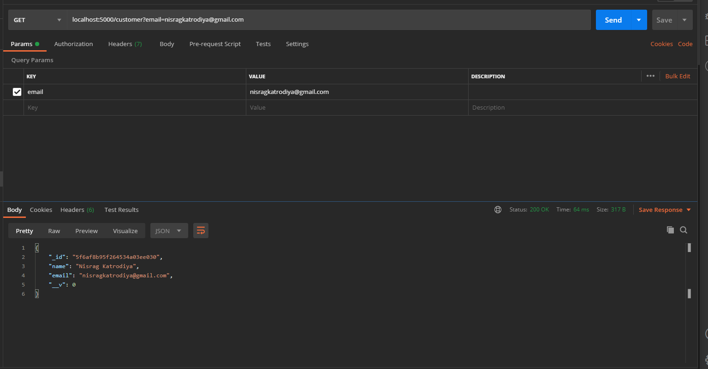
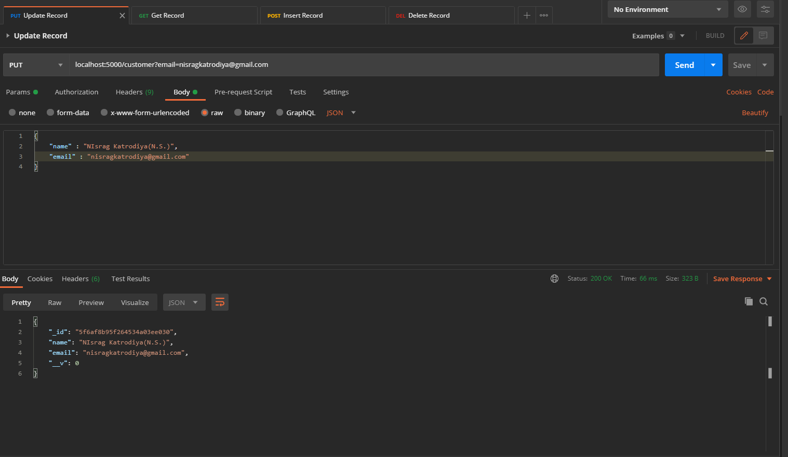
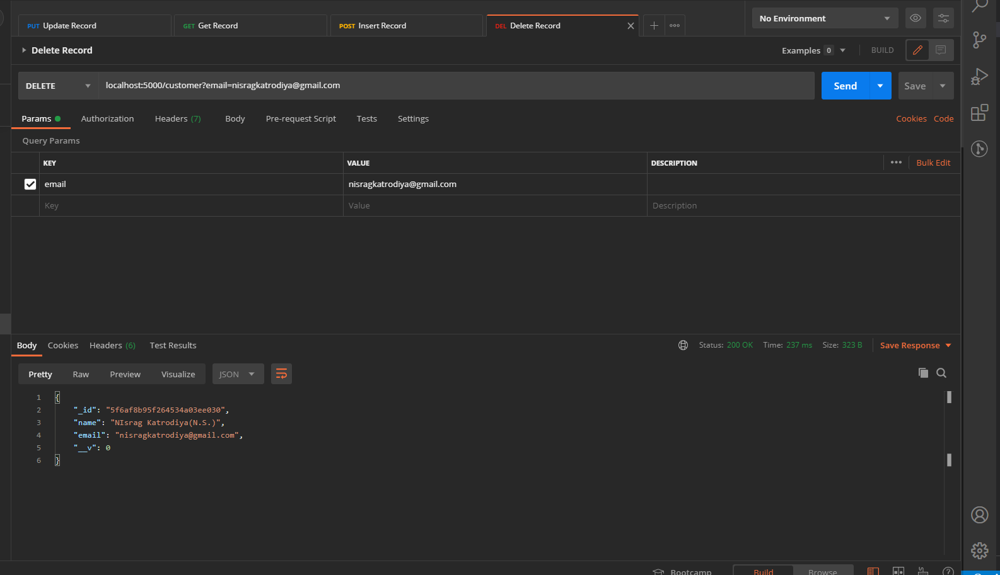
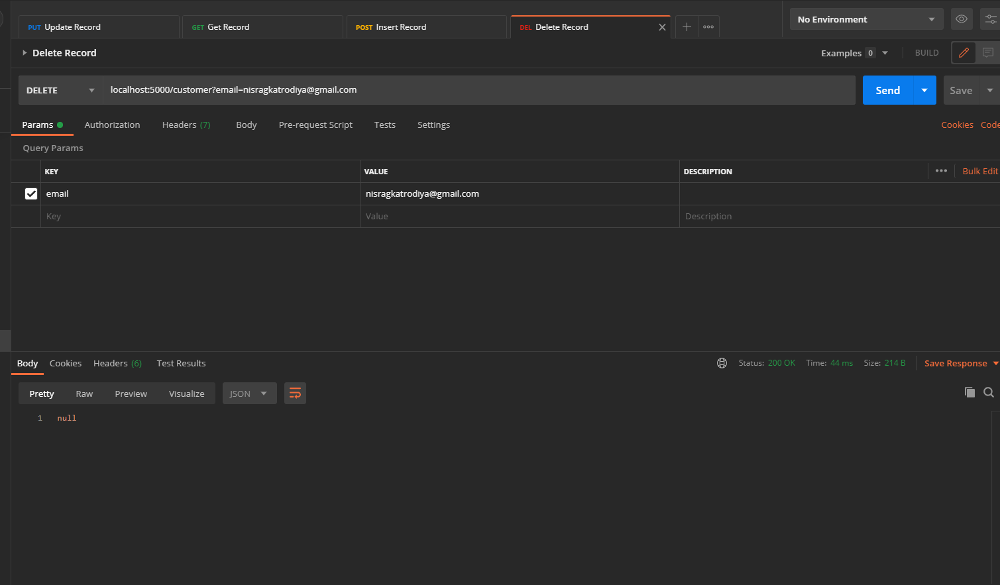

# CRUD-rest-api
 Create,Read,Update,Delete operations performing.

 ### Requiremnt software is Postman
  Click Here -> [Postman ](https://www.postman.com/downloads/)
  * Run command for Node js server
    - nodemon start
    - localhost:5000

 ### 1. Insert a record
 
 
 

### 2. Select a record
 
 
)

### 3. Update a record
 
 
 

 ### 4. Delete a record
 
 

 - I'm trying to second time to **delete** record. it show null

 
